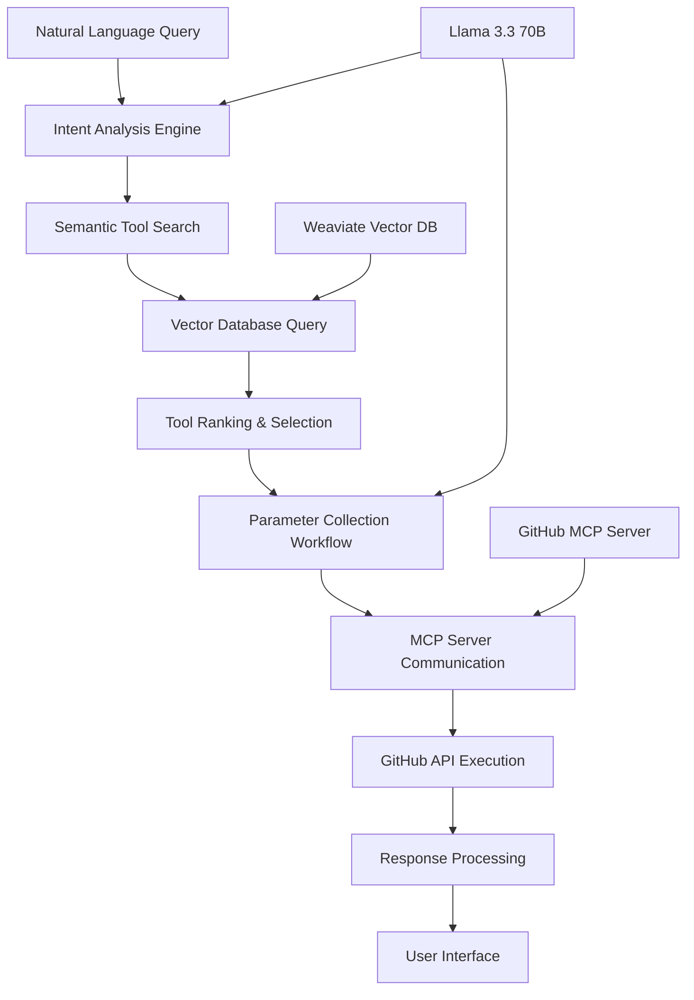

# GitHub MCP Tools Agent

[](https://python.org)
[](https://langchain-ai.github.io/langgraph/)
[](https://docker.com)
[](https://groq.com)
[](https://weaviate.io)
[](https://github.com)

> **Intelligent conversational interface that bridges natural language queries with GitHub's Model Context Protocol (MCP) server capabilities through advanced semantic search, automated parameter collection, and multi-turn conversation workflows.**

## 🏗️ System Architecture

This system implements a sophisticated conversational AI pipeline combining:

- **Semantic Tool Discovery** with vector similarity search and metadata filtering
- **Multi-Turn Conversation Management** using LangGraph state persistence
- **GitHub MCP Integration** through Docker containerized server communication
- **Intelligent Parameter Collection** with interactive workflow orchestration
- **Hybrid Search Architecture** combining vector embeddings with structured metadata
- **Advanced Intent Recognition** for natural language to GitHub operation mapping



## 🚀 Core Intelligence Components

### Enhanced Tool Storage System
- **Semantic Enrichment Pipeline**: Transforms raw MCP tool definitions into searchable entities
- **Functional Classification**: Automatic categorization by action type (create, read, update, delete)
- **Resource Type Mapping**: Intelligent grouping by GitHub entities (issues, PRs, repositories, workflows)
- **Use Case Generation**: AI-powered use case extraction and keyword association
- **Relationship Discovery**: Automated tool dependency and workflow mapping

### Conversational Workflow Engine
- **Multi-Phase Orchestration**: Tool discovery → selection → parameter collection → execution
- **State Persistence**: Long-term conversation context and user preference retention
- **Intelligent Routing**: Dynamic conversation flow based on user intent and context
- **Error Recovery**: Graceful handling of failed operations with retry mechanisms
- **Interactive Parameter Validation**: Real-time validation with user-friendly error messages

### Advanced Search Architecture
- **Hybrid Search Implementation**: Vector similarity combined with metadata filtering
- **Intent Extraction**: Natural language processing for action and resource type identification
- **Relevance Scoring**: Multi-factor ranking including similarity, complexity, and user preferences
- **Query Optimization**: Real-time query expansion and refinement
- **Result Personalization**: Learning from user selection patterns and feedback

## 🛠️ Technology Stack

| Component | Technology | Purpose |
|-----------|------------|---------|
| **Large Language Model** | Llama 3.3 70B (Groq API) | Natural language understanding and reasoning |
| **Workflow Engine** | LangGraph | State management and conversation orchestration |
| **Vector Database** | Weaviate | Semantic search and tool storage |
| **Embedding Model** | all-MiniLM-L6-v2 | Semantic similarity computation |
| **MCP Server** | GitHub MCP (Docker) | Standardized GitHub API access |
| **Container Platform** | Docker MCP Toolkits | Isolated execution environments |
| **API Client** | JSON-RPC over HTTP | MCP server communication protocol |
| **Monitoring** | LangSmith | Conversation flow analysis and debugging |

## 📂 Project Structure

```
github-mcp-agent/
├── core/
│   ├── chatbot.py                          # Main conversational interface
│   ├── workflow_engine.py                  # LangGraph orchestration logic
│   └── mcp_client.py                       # GitHub MCP server integration
├── storage/
│   ├── weaviate_manager.py                 # Vector database operations
│   ├── tool_enrichment.py                  # Semantic enhancement pipeline
│   └── hybrid_search.py                    # Search and ranking algorithms
├── data_processing/
│   ├── github_tools_extractor.py           # MCP tool definition parser
│   ├── semantic_classifier.py              # Tool categorization logic
│   └── intent_analyzer.py                  # Natural language intent extraction
├── workflows/
│   ├── tool_discovery.py                   # Search and selection workflows
│   ├── parameter_collection.py             # Interactive parameter gathering
│   └── execution_handler.py                # MCP execution and response processing
├── config/
│   ├── environment.py                      # Configuration management
│   ├── prompts.py                          # LLM prompt templates
│   └── schemas.py                          # Type definitions and validation
├── data/
│   ├── github_mcp_tools.json              # Raw tool definitions
│   └── enhanced_tools.json                # Processed tool metadata
├── docker/
│   ├── docker-compose.yml                 # Container orchestration
│   └── mcp-server.dockerfile              # Custom MCP server configuration
├── .env                                    # Environment variables
├── requirements.txt                        # Python dependencies
└── README.md                              # This documentation
```

## 🔧 Configuration & Setup

### Environment Requirements

```bash
# System Requirements
Python 3.12+
Docker Desktop with MCP Toolkits Support
4GB+ RAM (for embedding models and vector database)
Stable Internet Connection for API Access
8GB+ Storage for vector database and model cache
```

### API Configuration

Create `.env` file with required credentials:

```bash
# Language Model Configuration
GROQ_API_KEY=your_groq_api_key_here

# GitHub Integration
GITHUB_PERSONAL_ACCESS_TOKEN=your_github_token_here

# Vector Database Configuration
WEAVIATE_URL=http://localhost:8080
WEAVIATE_API_KEY=your_weaviate_key_here
EMBEDDING_MODEL=all-MiniLM-L6-v2

# Monitoring and Observability
LANGSMITH_TRACING=true
LANGSMITH_ENDPOINT=https://api.smith.langchain.com
LANGSMITH_API_KEY=your_langsmith_api_key
LANGSMITH_PROJECT=autogithubagent

# MCP Server Configuration
MCP_SERVER_HOST=localhost
MCP_SERVER_PORT=3000
MCP_TIMEOUT_SECONDS=30
```

### Dependencies Installation

```bash
# Clone repository
git clone <repository-url>
cd github-mcp-agent

# Create virtual environment
python -m venv venv
source venv/bin/activate  # On Windows: venv\Scripts\activate

# Install core dependencies
pip install langgraph
pip install weaviate-client
pip install sentence-transformers
pip install groq
pip install python-dotenv
pip install pydantic
pip install asyncio
pip install docker

# Or install from requirements
pip install -r requirements.txt
```

## 🚀 Getting Started

### 1. Docker MCP Server Setup

```bash
# Install Docker Desktop with MCP Toolkits support
# Download from: https://docker.com

# Pull GitHub MCP server image
docker pull github-mcp-server:latest

# Start GitHub MCP server
docker mcp gateway run

# Verify server is running
curl http://localhost:3000/health
```

### 2. Vector Database Deployment

```bash
# Option A: Local Weaviate (Recommended for development)
docker run -d \
  --name weaviate \
  -p 8080:8080 \
  -e QUERY_DEFAULTS_LIMIT=25 \
  -e AUTHENTICATION_ANONYMOUS_ACCESS_ENABLED=true \
  -e PERSISTENCE_DATA_PATH='/var/lib/weaviate' \
  cr.weaviate.io/semitechnologies/weaviate:1.24.0

# Option B: Weaviate Cloud
# 1. Sign up at https://console.weaviate.cloud
# 2. Create cluster and obtain API key
# 3. Update WEAVIATE_URL and WEAVIATE_API_KEY in .env
```

### 3. Tool Database Initialization

```bash
# Extract GitHub MCP tools from documentation
python data_processing/github_tools_extractor.py

# Initialize vector database with enhanced tools
python storage/weaviate_manager.py

# Verify tool storage
python -c "from storage.hybrid_search import search_tools; print(search_tools('create issue'))"
```

### 4. System Validation

```bash
# Test MCP server connection
python core/mcp_client.py --test-connection

# Validate vector database
python storage/weaviate_manager.py --health-check

# Test end-to-end workflow
python core/chatbot.py --demo-mode
```

### 5. Interactive Agent Launch

```bash
# Start conversational interface
python core/chatbot.py

# LangGraph Studio integration (optional)
langgraph dev
# Access studio at http://localhost:8123
```

## 💡 Usage Guide

### Natural Language Interactions

#### Tool Discovery Queries
```text
User: "I want to create a new issue in my repository"
Agent: Found 3 relevant GitHub tools:
1. create_or_update_issue - Create or update a GitHub issue
2. create_issue_comment - Add a comment to an existing issue  
3. list_issues - List issues in a repository

Select a tool (1-3):
```

#### Parameter Collection Workflow
```text
User: "1"
Agent: You selected create_or_update_issue. I need the following parameters:

Required:
- owner: Repository owner (username or organization)
- repo: Repository name
- title: Issue title

Optional:
- body: Issue description
- labels: Comma-separated labels
- assignees: Comma-separated usernames

Please provide the repository owner:
```

#### Execution and Results
```text
User: "myusername"
Agent: Repository name:
User: "my-project"
Agent: Issue title:
User: "Bug in user authentication"
Agent: Issue description (optional, press Enter to skip):
User: "Users cannot log in with OAuth"

Ready to execute create_or_update_issue with:
- owner: myusername
- repo: my-project  
- title: Bug in user authentication
- body: Users cannot log in with OAuth

Type 'execute' to proceed or 'modify' to change parameters:
```

### Advanced Query Patterns

#### Multi-Step Workflows
```text
"Create an issue, assign it to john, and add it to the project board"
```

#### Conditional Operations
```text
"List all open pull requests and close any that are older than 30 days"
```

#### Batch Operations
```text
"Add the 'needs-review' label to all PRs from the last week"
```

## 🔍 Tool Enhancement Pipeline

### Semantic Classification Process

#### Raw Tool Processing
```python
# Transform MCP tool definitions
tool_enhancement_pipeline = [
    extract_raw_definitions(),
    classify_by_function(),        # create, read, update, delete, list
    classify_by_resource(),        # issue, pr, repository, workflow
    generate_use_cases(),          # AI-powered use case extraction
    extract_keywords(),            # Semantic keyword generation
    assess_complexity(),           # Difficulty and parameter complexity
    discover_relationships(),      # Tool dependency mapping
    generate_embeddings()          # Vector representation creation
]
```

#### Enhanced Tool Metadata
```json
{
    "name": "create_or_update_issue",
    "function_type": "create",
    "resource_type": "issue",
    "complexity": "medium",
    "use_cases": [
        "Report software bugs",
        "Request new features", 
        "Track project tasks"
    ],
    "keywords": ["bug", "feature", "task", "report", "create"],
    "related_tools": ["list_issues", "create_issue_comment"],
    "embedding_vector": [0.1, -0.3, 0.7, ...],
    "parameter_complexity": 2.3
}
```

### Search and Ranking Algorithm

#### Intent Analysis
```python
def analyze_user_intent(query):
    """Extract action type and resource type from natural language"""
    return {
        "action_type": extract_action_verbs(query),      # create, list, update
        "resource_type": identify_github_entities(query), # issue, pr, repo  
        "context_keywords": extract_domain_terms(query),
        "complexity_preference": infer_user_skill_level(query)
    }
```

#### Hybrid Search Implementation
```python
def hybrid_tool_search(query, limit=5):
    """Combine vector similarity with metadata filtering"""
    intent = analyze_user_intent(query)
    
    # Vector similarity search
    vector_results = weaviate_client.query_near_text(
        query=query,
        properties=["name", "description", "use_cases"],
        limit=20
    )
    
    # Metadata filtering
    filtered_results = apply_intent_filters(
        vector_results, 
        intent["action_type"], 
        intent["resource_type"]
    )
    
    # Multi-factor ranking
    ranked_results = rank_by_relevance(
        filtered_results,
        vector_similarity_weight=0.4,
        metadata_match_weight=0.3,
        use_case_overlap_weight=0.2,
        complexity_fit_weight=0.1
    )
    
    return ranked_results[:limit]
```

## 🛡️ Security & Authentication

### GitHub Access Control
- **Personal Access Token**: Secure token-based authentication
- **Scope Management**: Minimum required permissions for operations
- **Rate Limit Handling**: Automatic backoff and retry mechanisms
- **Audit Logging**: Comprehensive tracking of all GitHub operations

### Container Security
- **Isolated Execution**: Docker containers for secure MCP server operations
- **Resource Limits**: CPU and memory constraints for container safety
- **Network Security**: Restricted container network access
- **Secret Management**: Secure handling of API keys and tokens

### Data Privacy
- **Local Processing**: Tool metadata and conversations stored locally
- **No Data Persistence**: User queries not stored after session ends
- **Minimal API Exposure**: Only necessary GitHub data accessed
- **Secure Communication**: HTTPS for all external API calls

## 📈 Performance Optimization

### Vector Search Efficiency
```python
# Optimized search configuration
search_config = {
    "vector_cache_size": "1GB",
    "query_timeout": "5s", 
    "max_results": 100,
    "embedding_batch_size": 32,
    "index_refresh_interval": "30s"
}
```

### Conversation State Management
- **Memory Optimization**: Efficient state serialization and compression
- **Context Pruning**: Automatic removal of outdated conversation context
- **Caching Strategy**: Tool definition and embedding caching
- **Async Processing**: Non-blocking MCP server communication

### Resource Utilization Metrics
```json
{
    "average_query_time": "1.2 seconds",
    "vector_search_time": "0.3 seconds",
    "parameter_collection_time": "8.5 seconds",
    "mcp_execution_time": "2.1 seconds",
    "memory_usage": "2.1GB",
    "embedding_cache_hit_rate": 0.87
}
```

## 🔧 Troubleshooting Guide

### Common Setup Issues

#### Docker MCP Server Problems
```bash
❌ Error: MCP server connection refused

Solutions:
1. Verify Docker is running
   docker ps
2. Check MCP server logs
   docker logs github-mcp-server
3. Restart MCP gateway
   docker mcp gateway restart
4. Verify port availability
   netstat -an | grep 3000
```

#### Weaviate Connection Issues
```bash
❌ Error: Could not connect to Weaviate

Solutions:
1. Check Weaviate container status
   docker ps | grep weaviate
2. Verify port configuration
   curl http://localhost:8080/v1/meta
3. Reset Weaviate data
   docker volume rm weaviate_data
4. Check authentication settings
```

#### API Authentication Failures
```bash
❌ Error: GitHub API authentication failed

Solutions:
1. Verify token permissions
   curl -H "Authorization: token $GITHUB_TOKEN" https://api.github.com/user
2. Check token scopes
   # Required: repo, issues, pull_requests
3. Regenerate token if expired
4. Update .env file with new token
```

### Performance Issues

#### Slow Vector Search
```bash
# Optimize Weaviate configuration
docker run -d \
  --name weaviate \
  -p 8080:8080 \
  -e QUERY_DEFAULTS_LIMIT=25 \
  -e PERSISTENCE_DATA_PATH='/var/lib/weaviate' \
  -e DEFAULT_VECTORIZER_MODULE='none' \
  -e ENABLE_MODULES='text2vec-transformers' \
  cr.weaviate.io/semitechnologies/weaviate:1.24.0
```

#### Memory Usage Optimization
```python
# Reduce embedding model memory usage
import torch
torch.set_num_threads(2)
os.environ["TOKENIZERS_PARALLELISM"] = "false"
```

## 🚀 Advanced Features

### Custom Tool Integration
```python
# Add custom GitHub operations
def register_custom_tool(name, description, parameters, execution_func):
    """Register new MCP tool with the system"""
    enhanced_tool = enhance_tool_definition({
        "name": name,
        "description": description, 
        "parameters": parameters
    })
    
    store_in_weaviate(enhanced_tool)
    register_execution_handler(name, execution_func)
```

### Workflow Templates
```python
# Define reusable GitHub workflows
workflows = {
    "bug_triage": [
        "create_or_update_issue",
        "add_labels_to_issue", 
        "assign_issue",
        "add_to_project"
    ],
    "code_review": [
        "list_pull_requests",
        "create_review", 
        "request_reviewers"
    ]
}
```

### Analytics and Insights
- **Usage Pattern Analysis**: Track most-used tools and workflows
- **Query Success Rates**: Monitor search accuracy and user satisfaction
- **Performance Metrics**: Response time analysis and optimization recommendations
- **Tool Popularity Trends**: Identify commonly requested GitHub operations

## 🏢 Production Deployment

### Scalability Considerations
```python
# Production configuration
production_config = {
    "weaviate_replicas": 3,
    "embedding_service_instances": 5, 
    "mcp_server_pool_size": 10,
    "max_concurrent_conversations": 100,
    "vector_db_sharding": True
}
```

### Monitoring and Observability
```bash
# LangSmith production monitoring
LANGSMITH_TRACING=true
LANGSMITH_SAMPLING_RATE=0.1
LANGSMITH_ALERTS=true
LANGSMITH_PERFORMANCE_TRACKING=true
```

### High Availability Setup
- **Load Balancing**: Multiple MCP server instances with round-robin routing
- **Database Replication**: Weaviate cluster with automatic failover
- **Backup Strategy**: Regular vector database snapshots and recovery procedures
- **Health Checks**: Comprehensive monitoring of all system components

## 📄 License & Support

### System Requirements
- **Python Version**: 3.12 or higher
- **Memory**: 4GB minimum (8GB recommended for production)
- **Storage**: 8GB for vector database and model cache
- **Network**: Reliable internet for GitHub API and Groq access

### Contributing Guidelines
- **Bug Reports**: Include LangSmith trace IDs for debugging
- **Feature Requests**: Provide specific GitHub workflow use cases
- **Tool Extensions**: Follow MCP protocol specifications
- **Documentation**: Update README with new capabilities and examples

---

**This GitHub MCP Tools Agent demonstrates enterprise-grade conversational AI architecture, combining semantic search, workflow orchestration, and containerized service integration for intelligent GitHub operation management.**
